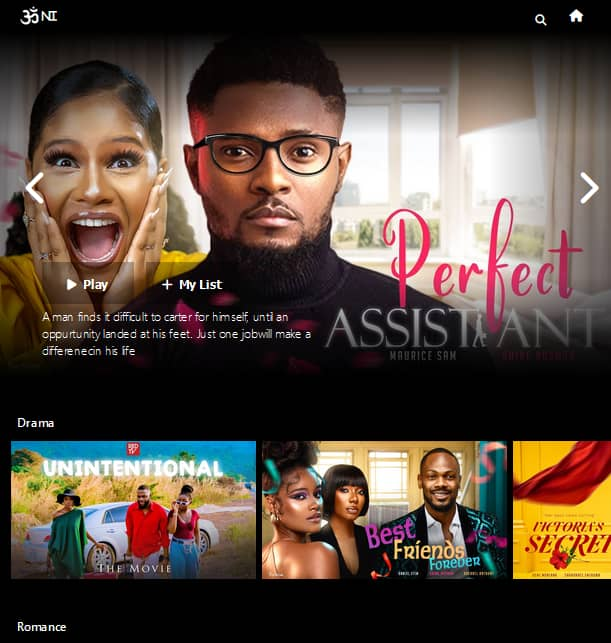

# Omni

Omni is a simple video streaming platform for Nigerian movies/series.

## Usage

Simply go to [Omni](http://cecilia89.pythonanywhere.com) to use the app.

Here's a quick
[demonstration](https://www.youtube.com/watch?v=M_5-1-AHNQM).

## Technologies used
   __Frontend__  
  * 
  *  
  * 

  __Backend__  
  *  
  * 

  __Database__  
  * 
 
  __Project Mnagement__  
  * 

## Contributing

Pull requests are welcome. For major changes, please open an issue first
to discuss what you would like to change.

Please make sure to update tests as appropriate.

## Authors
* [Cecilia Atabong](https://github.com/cecilia-89)
* [Aiyebogan Temitope](https://github.com/aphrotee)
* [Adeboye Akingbelure](https://github.com/boye111)
